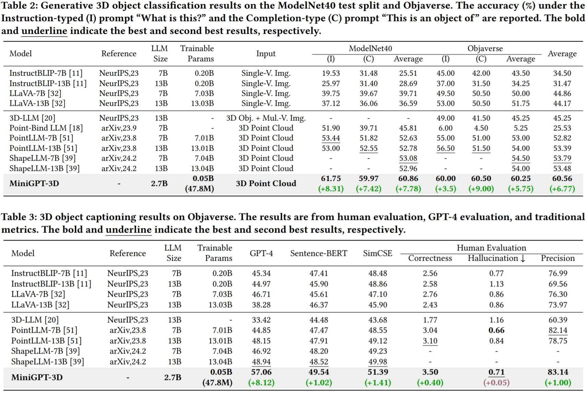
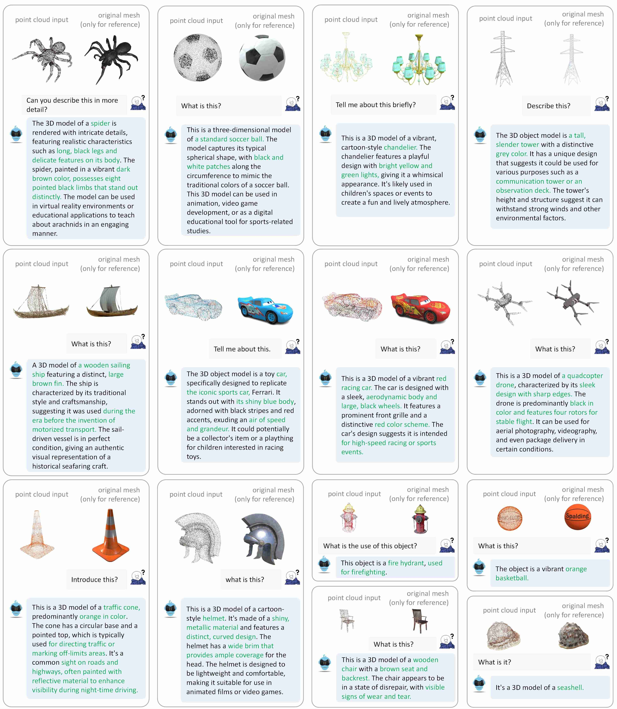
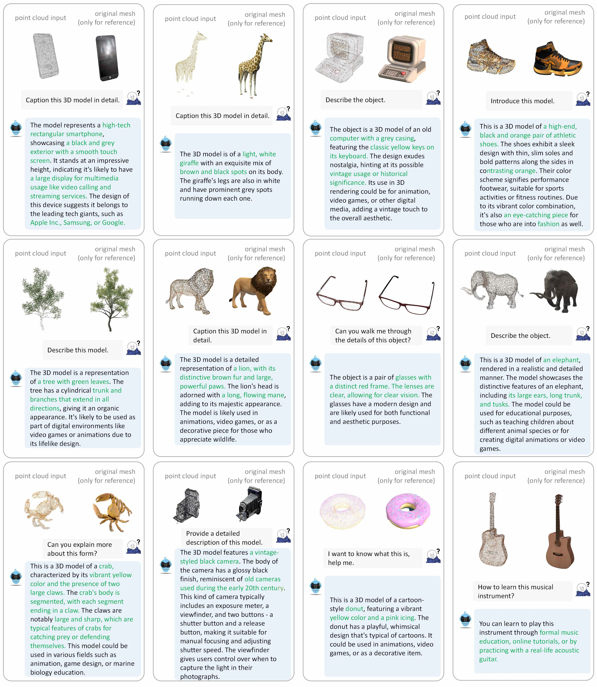

# MiniGPT-3D: Efficiently Aligning 3D Point Clouds with Large Language Models using 2D Priors

[](https://paperswithcode.com/sota/generative-3d-object-classification-on-2?p=minigpt-3d-efficiently-aligning-3d-point)
[](https://paperswithcode.com/sota/generative-3d-object-classification-on-1?p=minigpt-3d-efficiently-aligning-3d-point)
[](https://paperswithcode.com/sota/3d-object-captioning-on-objaverse-1?p=minigpt-3d-efficiently-aligning-3d-point)
 

[](https://arxiv.org/pdf/2405.01413)

## 🏠 About

 


<!-- contents with emoji -->
## 📋 Contents

- [🔍 Overview](#-overview)
- [💬 Dialogue Examples](#-dialogue-examples)
- [📝 TODO List](#-todo-list)
- [🔗 Citation](#-citation)
- [📄 License](#-license)
- [📚 Related Work](#-related-work)
- [👏 Acknowledgements](#-acknowledgements)

## 🔍 Overview

### Model


- We present MiniGPT-3D, an efficient and powerful 3D-LLM that  aligns 3D points with LLMs  using 2D priors. It is trained with **47.8 M learnable parameters**  in just **26.8 hours** on **a single RTX 3090 GPU**. 
- We propose an efficient four-stage training strategy in a cascaded way, gradually transferring the knowledge from 2D-LLMs.
- We design the mixture of query experts to aggregate multiple features from different experts with only **0.4M parameters**.
- Extensive experiments show  the  superior performance of MiniGPT-3D on multiple tasks  while **reducing the training time and parameters by up to 6x and 260x**, respectively. 

### Experiment Results
#### Quantitative Comparisons with baselines.


#### Qualitative Comparisons with baselines.


## 💬 Dialogue Examples





## 📝 TODO List

- [ ] Release inferencing codes with checkpoints.
- [ ] Release training codes.
- [ ] Release evaluation codes.
- [ ] Release gradio demo codes.
- [ ] Add online demo.


## 🔗 Citation
If you find our work helpful, please consider citing:
```bibtex
@article{tang2024minigpt_3d,
  title={MiniGPT-3D: Efficiently Aligning 3D Point Clouds with Large Language Models using 2D Priors},
  author={Tang, Yuan and Han, Xu and Li, Xianzhi and Yu, Qiao and Hao, Yixue and Hu, Long and Chen, Min},
  journal={https://arxiv.org/abs/2405.01413},
  year={2024}
}
```

## 📄 License
<a rel="license" href="http://creativecommons.org/licenses/by-nc-sa/4.0/"></a>
<br />
This work is under the <a rel="license" href="http://creativecommons.org/licenses/by-nc-sa/4.0/">Creative Commons Attribution-NonCommercial-ShareAlike 4.0 International License</a>.

## 📚 Related Work
Together, Let's make LLM for 3D great!
- [Point-Bind & Point-LLM](https://arxiv.org/abs/2309.00615): It aligns point clouds with Image-Bind to reason multi-modality input without 3D-instruction data training.
- [3D-LLM](https://arxiv.org/abs/2307.12981): employs 2D foundation models to encode multi-view images of 3D point clouds.
- [PointLLM](https://arxiv.org/abs/2308.16911): employs 3D point clouds with LLaVA.
- [ShapeLLM](http://arxiv.org/abs/2402.17766): Combine a  powerful point cloud encoder with LLM for embodied scenes.


## 👏 Acknowledgements
We would like to thank the authors of [PointLLM](https://github.com/OpenRobotLab/PointLLM), [Objaverse](https://objaverse.allenai.org) and [TinyGPT-V](https://github.com/DLYuanGod/TinyGPT-V)  for their great works and repos.
