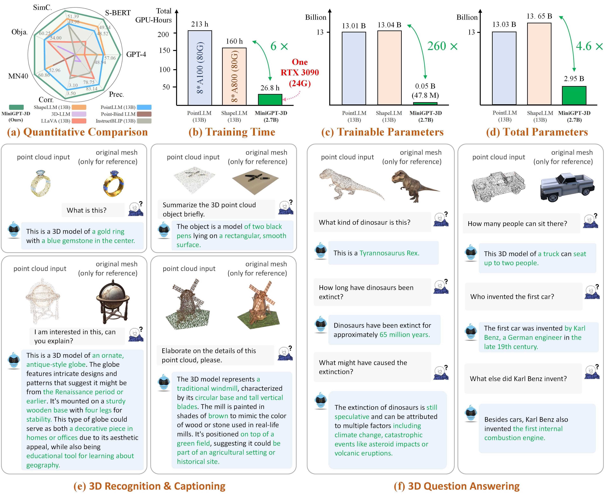

<p align="center">
<h1 align="center"><strong>MiniGPT-3D: Efficiently Aligning 3D Point Clouds with Large Language Models using 2D Priors</strong></h1>
  <p align="center">
    Yuan Tang&emsp; Xu Han&emsp; Xianzhi Li*&emsp; Qiao Yu&emsp; Yixue Hao&emsp; Long Hu&emsp; Min Chen 
    <br>
    Huazhong University of Science and Technology&emsp;South China University of Technology
  </p>
</p>

<p align="center">
    <a><strong>ACM MM 2024 </strong></a>
    <a href='https://tangyuan96.github.io/minigpt_3d_project_page/'></a>
    <a href='https://arxiv.org/pdf/2405.01413'></a>
    <a href='https://huggingface.co/YuanTang96/MiniGPT-3D'></a>
</p>


[](https://paperswithcode.com/sota/generative-3d-object-classification-on-2?p=minigpt-3d-efficiently-aligning-3d-point)
[](https://paperswithcode.com/sota/generative-3d-object-classification-on-1?p=minigpt-3d-efficiently-aligning-3d-point)
[](https://paperswithcode.com/sota/3d-object-captioning-on-objaverse-1?p=minigpt-3d-efficiently-aligning-3d-point)
 


## 🏠 About





## 🔥 News
- [2024-08] 💥 We release the training and inferencing codes, model checkpoints of paper, and the gradio demo codes for MiniGPT-3D.
- [2024-08] 🍾 Check out our exploration of 3D data-efficient point-language understanding [GreenPLM](https://arxiv.org/pdf/2408.15966).
- [2024-07] 🎉 Our [Mamba3D](https://github.com/xhanxu/Mamba3D) is also accepted by ACM MM 2024! We achieve **92.64% Acc. SoTA** on the ScanObjectNN supervised learning classification with only linear complexity! Check it out!
- [2024-07] 🎉 Our MiniGPT-3D is accepted by ACM MM 2024!
- [2024-05] 💥 We release the [paper](https://arxiv.org/pdf/2405.01413) of MiniGPT-3D.  

<!-- contents with emoji -->
## 📋 Contents

- [🔍 Overview](#-overview)
- [💬 Dialogue Examples](#-dialogue-examples)
- [📦 Training and Evaluation](#-Training-and-Evaluation)
- [📝 TODO List](#-todo-list)
- [🔗 Citation](#-citation)
- [📄 License](#-license)
- [📚 Related Work](#-related-work)
- [👏 Acknowledgements](#-acknowledgements)

## 🔍 Overview

### Model


- We present MiniGPT-3D, an efficient and powerful 3D-LLM that  aligns 3D points with LLMs  using 2D priors. It is trained with **<span style="color:green;">47.8 M</span>** learnable parameters  in just **<span style="color:green;">26.8 hours on a single RTX 3090 GPU</span>**. 
- We propose an efficient four-stage training strategy in a cascaded way, gradually transferring the knowledge from 2D-LLMs.
- We design the mixture of query experts to aggregate multiple features from different experts with only 0.4M parameters.
- Extensive experiments show  the  superior performance of MiniGPT-3D on multiple tasks  while **<span style="color:green;">reducing the training time and parameters by up to 6x and 260x</span>**, respectively. 
 
**Note:** MiniGPT-3D takes **<span style="color:skyblue;">the first step in efficient 3D-LLM</span>**, we hope  that MiniGPT-3D can bring new insights to this community. 


### Experiment Results
#### Quantitative Comparisons with baselines <span style="color:red;">[Using close-source LLM GPT-3.5 and GPT-4 to evaluate]</span>.


#### Quantitative Comparisons with baselines <span style="color:green;">[Using open-source LLM  Qwen2-72B-Instruct to evaluate]</span>
The results refer from  [GreenPLM](https://arxiv.org/pdf/2408.15966).


#### Qualitative Comparisons with baselines.

 
## 💬 Dialogue Examples
Please refer to our paper for more dialogue examples.


## 📦 Training and Evaluation
### Installation
We test our codes under the following environment:
- One RTX 3090 GPU (24G)
- Ubuntu 18.04.5
- NVIDIA Driver: 515.105.01
- CUDA 11.7
- Python 3.9.18
- Pytorch 2.0.0

To start: 
1. Clone this repository.
    ```bash
    git clone https://github.com/TangYuan96/MiniGPT-3D.git
    cd MiniGPT-3D
    ```

2. Install packages

   By default, you have installed conda.

    ```bash
    conda env create -f environment.yml
    conda activate minigpt_3d
    bash env_install.sh
    ```
   

### Data Preparation 

1. Download all [data files](https://huggingface.co/datasets/RunsenXu/PointLLM/tree/main). They require about 78GB of storage space.  
2. Organize 660K Objaverse colored point clouds. Run the following command to merge the two files into one and uncompress it. This will produce a folder named `8192_npy` containing 660K point cloud files named `{Objaverse_ID}_8192.npy`. Each file is a numpy array with dimensions (8192, 6), where the first three dimensions are `xyz` and the last three dimensions are `rgb` in [0, 1] range.
    ```bash
    cat Objaverse_660K_8192_npy_split_a* > Objaverse_660K_8192_npy.tar.gz
    tar -xvf Objaverse_660K_8192_npy.tar.gz
    ```
   Then, move all files in `8192_npy` folder  to `./data/objaverse_data` folder.
3. Organize annotation files.  Move all json files  and txt files to   `./data/anno_data` folder.
4. Organize the test data file of ModelNet40. Move `modelnet40_test_8192pts_fps.dat` to   `./data/modelnet40_data` folder.

Finally, the overall data directory structure should be:
``` 
MiniGPT-3D/data
|-- anno_data
|   |-- PointLLM_brief_description_660K.json
|   |-- PointLLM_brief_description_660K_filtered.json
|   |-- PointLLM_brief_description_val_200_GT.json
|   |-- PointLLM_complex_instruction_70K.json
|   |-- object_ids_660K.txt
|   `-- val_object_ids_3000.txt
|-- modelnet40_data 
|   |-- modelnet40_test_8192pts_fps.dat
|-- objaverse_data
|   |-- 00000054c36d44a2a483bdbff31d8edf_8192.npy
|   |-- 00001ec0d78549e1b8c2083a06105c29_8192.npy
|   .......
```


### Weight Preparation 
We sort out the model weights required by MiniGPT-3D during training and inference.

1. Download [model weights](https://huggingface.co/YuanTang96/MiniGPT-3D/tree/main).
2. Move the the `params_weight` folder to `MiniGPT-3D` project folder.

Finally, the overall data directory structure should be:
``` 
MiniGPT-3D
|-- params_weight
|   |-- MiniGPT_3D_stage_3       # Our MiniGPT-3D stage III weight, needed to verify the results of paper
|   |-- MiniGPT_3D_stage_4       # Our MiniGPT-3D stage IV weight, Needed to verify the results of paper
|   |-- Phi_2                    # LLM weight 
|   |-- TinyGPT_V_stage_3        # 2D-LLM weights including  loRA & Norm of LLM and  projector 
|   |-- all-mpnet-base-v2        # Used in the caption traditional evaluation
|   |-- bert-base-uncased        # Used in initialize Q-former
|   |-- pc_encoder               # point cloud encoder
|   `-- sup-simcse-roberta-large # Used in the caption traditional evaluation
|-- train_configs
|   `-- MiniGPT_3D
|   .......
```

### Gradio Conversation Demo 
   1. You can run the following command to start a local gradio conversation demo:

      ```bash
      python UI_demo.py --cfg-path ./eval_configs/MiniGPT_3D_conv_UI_demo.yaml --gpu-id 0
      ```
   2. Then, copy the link `http://127.0.0.1:7860/` to your browser, you can input the supported [Objaverse object id](https://drive.google.com/file/d/1gLwA7aHfy1KCrGeXlhICG9rT2387tWY8/view?usp=sharing) (660K objects) or upload one object file (.ply or .npy) to talk with our MiniGPT-3D.

   **Example: Input the object ID:**
   

   **Example: Upload the object file:**
   


### Train

#### Edit the output path of each Stages

**If you want to use the default output path of each Stages, you can ignore the following steps.**
1. Set your output path of Stage I  to [here](train_configs/MiniGPT_3D/stage_1.yaml#L44) at Line 44 and [here](train_configs/MiniGPT_3D/stage_2.yaml#L8) at Line 8.
2. Set your output path of Stage II  to [here](train_configs/MiniGPT_3D/stage_2.yaml#L51) at Line 51 and [here](train_configs/MiniGPT_3D/stage_3.yaml#L7) at Line 7.
3. Set your output path of Stage III  to [here](train_configs/MiniGPT_3D/stage_3.yaml#L66) at Line 66 and [here](train_configs/MiniGPT_3D/stage_4.yaml#L7) at Line 7.
4. Set your  output path of Stage IV  to [here](train_configs/MiniGPT_3D/stage_4.yaml#L66) at Line 66.

#### Train Stage I


    CUDA_VISIBLE_DEVICES=0 python  train.py --cfg-path ./train_configs/MiniGPT_3D/stage_1.yaml

####  Train Stage II


    CUDA_VISIBLE_DEVICES=0 python  train.py --cfg-path ./train_configs/MiniGPT_3D/stage_2.yaml


####  Train Stage III


    CUDA_VISIBLE_DEVICES=0 python  train.py --cfg-path ./train_configs/MiniGPT_3D/stage_3.yaml


####  Train Stage IV


    CUDA_VISIBLE_DEVICES=0 python  train.py --cfg-path ./train_configs/MiniGPT_3D/stage_4.yaml


### Evaluation

#### A. Set the output path of Stage III & IV in evaluation configuration
   
 If you just want to verify the results of our paper, you can  ignore the following steps:
   
1. Set your the output path of Stage III to [here](eval_configs/benchmark_evaluation_paper.yaml#L8) at Line 8.

2. Set your the output path of Stage IV to [here](eval_configs/benchmark_evaluation_paper.yaml#L9) at Line 9.


#### B. Output the result jsons

1. Output the result of open vocabulary classification on objaverse
   
   ```bash
   # Prompt 0: 
   export PYTHONPATH=$PWD
   CUDA_VISIBLE_DEVICES=0 python pointllm/eval/eval_objaverse.py --out_path ./output/test --task_type classification  --cfg-path ./eval_configs/benchmark_evaluation_paper.yaml    --prompt_index 0 
   ```
 
   ```bash
   # Prompt 1: 
   export PYTHONPATH=$PWD
   CUDA_VISIBLE_DEVICES=0 python pointllm/eval/eval_objaverse.py --out_path ./output/test --task_type classification  --cfg-path ./eval_configs/benchmark_evaluation_paper.yaml    --prompt_index 1
   ```
2. Output the result of close-set zero-shot classification on ModelNet40
   ```bash
   # Prompt 0:
   export PYTHONPATH=$PWD
   CUDA_VISIBLE_DEVICES=0 python pointllm/eval/eval_modelnet_cls.py --out_path ./output/test  --cfg-path ./eval_configs/benchmark_evaluation_paper.yaml    --prompt_index 0
   ```
   ```bash
   # Prompt 1: 
   export PYTHONPATH=$PWD
   CUDA_VISIBLE_DEVICES=0 python pointllm/eval/eval_modelnet_cls.py --out_path ./output/test  --cfg-path ./eval_configs/benchmark_evaluation_paper.yaml    --prompt_index 1
   ```
3. Output the result of object captioning on objaverse

   ```bash
   export PYTHONPATH=$PWD
   CUDA_VISIBLE_DEVICES=0 python pointllm/eval/eval_objaverse.py --out_path ./output/test  --task_type captioning  --cfg-path ./eval_configs/benchmark_evaluation_paper.yaml    --prompt_index 2
   ```
#### C. Evaluate Json Results

##### a. Evaluate with close-source LLM from OpenAI  <span style="color:red;">[Not recommended]</span>
   
In [GreenPLM](https://arxiv.org/pdf/2408.15966), we have noticed that the  close-source LLMs  GPT-3.5 and GPT-4   have two major drawbacks: **inconsistent API versions and high evaluation costs (~35 CNY or 5 USD per  one evaluation)**. For instance, the GPT-3.5-turbo-0613 model used in  PointLLM and  our MiniGPT-3D  is **no longer maintained, making it difficult to replicate the results**.

<details>
  <summary>The following steps are for evaluation using OpenAI API. Maybe it does not work! (click to expand)</summary>

   1. Evaluate the open vocabulary classification on objaverse
   ```bash
      export PYTHONPATH=$PWD
      export OPENAI_API_KEY=sk-****
      python pointllm/eval/evaluator.py --results_path /path/to/evaluation/PointLLM_brief_description_val_200_GT_Objaverse_classification_prompt0.json  --model_type gpt-4-0613 --eval_type open-free-form-classification --parallel --num_workers 15
   ```

   ```bash
      export PYTHONPATH=$PWD
      export OPENAI_API_KEY=sk-****
      python pointllm/eval/evaluator.py --results_path /path/to/evaluation/PointLLM_brief_description_val_200_GT_Objaverse_classification_prompt1.json  --model_type gpt-4-0613 --eval_type open-free-form-classification --parallel --num_workers 15
   ```

   2. Evaluate the close-set zero-shot classification on ModelNet40

   ```bash
      export PYTHONPATH=$PWD
      export OPENAI_API_KEY=sk-****
      python pointllm/eval/evaluator.py --results_path /path/to/evaluation/ModelNet_classification_prompt0.json  --model_type gpt-3.5-turbo-0613 --eval_type modelnet-close-set-classification --parallel --num_workers 15
   ```

   ```bash
      export PYTHONPATH=$PWD
      export OPENAI_API_KEY=sk-****
      python pointllm/eval/evaluator.py --results_path /path/to/evaluation/ModelNet_classification_prompt1.json  --model_type gpt-3.5-turbo-0613 --eval_type modelnet-close-set-classification --parallel --num_workers 15
   ```
   3. Evaluate the object captioning on objaverse

   ```bash
   export PYTHONPATH=$PWD
   export OPENAI_API_KEY=sk-****
   python pointllm/eval/evaluator.py --results_path /path/to/evaluation/PointLLM_brief_description_val_200_GT_Objaverse_captioning_prompt2.json --model_type gpt-4-0613 --eval_type object-captioning --parallel --num_workers 15
   ```

</details>


##### b. Evaluate with open-source Qwen2-72B-Instruct <span style="color:green;">[Recommend]</span>
   
   In [GreenPLM](https://arxiv.org/pdf/2408.15966), we propose new 3D object classification and caption benchmarks using **GPT-4 level open-source Qwen2-72B-Instruct to make evaluations cost-effective and results consistently reproducible**.

   - You can get the **DASHSCOPE_API_KEY**   from [aliyun](https://bailian.console.aliyun.com/?apiKey=1#/api-key). The evaluation may require 9 CNY (~ 1.3 USD).
   - If you have enough GPU resources, you can also build your own Qwen2-72B-Instruct service, following the [Qwen2](https://github.com/QwenLM/Qwen2?tab=readme-ov-file). Then evaluate the results for free!

   1. Evaluate the open vocabulary classification on objaverse
   ```bash
   export PYTHONPATH=$PWD
   export DASHSCOPE_API_KEY=sk-xxx
   python ./pointllm/eval/evaluator_opensource_llm_QwenAPI.py  \
           --results_path /path/to/evaluation/PointLLM_brief_description_val_200_GT_Objaverse_classification_prompt0.json  \
           --eval_type open-free-form-classification  \
           --model_type qwen2-72b-instruct \
           --parallel --num_workers 4
   ```

   ```bash
   export PYTHONPATH=$PWD
   export DASHSCOPE_API_KEY=sk-xxx
   python ./pointllm/eval/evaluator_opensource_llm_QwenAPI.py  \
           --results_path /path/to/evaluation/PointLLM_brief_description_val_200_GT_Objaverse_classification_prompt1.json  \
           --eval_type open-free-form-classification  \
           --model_type qwen2-72b-instruct \
           --parallel --num_workers 4
   ```

   2. Evaluate the close-set zero-shot classification on ModelNet40

   ```bash
   export PYTHONPATH=$PWD
   export DASHSCOPE_API_KEY=sk-xxx
   python ./pointllm/eval/evaluator_opensource_llm_QwenAPI.py  \
       --results_path /path/to/evaluation/ModelNet_classification_prompt0.json  \
       --eval_type modelnet-close-set-classification  \
       --model_type qwen2-72b-instruct \
       --parallel --num_workers 4
   ```
   
   ```bash
   export PYTHONPATH=$PWD
   export DASHSCOPE_API_KEY=sk-xxx
   python ./pointllm/eval/evaluator_opensource_llm_QwenAPI.py  \
       --results_path /path/to/evaluation/ModelNet_classification_prompt1.json  \
       --eval_type modelnet-close-set-classification  \
       --model_type qwen2-72b-instruct \
       --parallel --num_workers 4
   ```

   3. Evaluate the object captioning on objaverse

   ```bash
   export PYTHONPATH=$PWD
   export DASHSCOPE_API_KEY=sk-xxx
   python ./pointllm/eval/evaluator_opensource_llm_QwenAPI.py  \
           --results_path /path/to/evaluation/PointLLM_brief_description_val_200_GT_Objaverse_captioning_prompt2.json  \
           --eval_type object-captioning  \
           --model_type qwen2-72b-instruct \
           --parallel --num_workers 4
  ```

##### c. Traditional Metric Evaluation
For the object captioning task, run the following command to evaluate model outputs with traditional metrics  Sentence-BERT and SimCSE.

```bash
CUDA_VISIBLE_DEVICES=0 python pointllm/eval/traditional_evaluator.py --results_path /path/to/evaluation/PointLLM_brief_description_val_200_GT_Objaverse_captioning_prompt2.json
```


### Run local gradio demo using your weights
   

1. Set your the output path of Stage III  [here](eval_configs/MiniGPT_3D_conv_UI_demo.yaml#L8) at Line 8.

2. Set your the output path of Stage IV  [here](eval_configs/MiniGPT_3D_conv_UI_demo.yaml#L9) at Line 9.
3. You can run the following command to start a local gradio conversation demo:

      ```bash
      python UI_demo.py --cfg-path ./eval_configs/MiniGPT_3D_conv_UI_demo.yaml --gpu-id 0
      ```


## 📝 TODO List

- [x] Release inferencing codes with checkpoints.
- [x] Release training codes.
- [x] Release evaluation codes.
- [x] Release gradio demo codes.
- [ ] Add online demo.


## 🔗 Citation
If you find our work helpful, please consider citing:
```bibtex
@article{tang2024minigpt,
  title={MiniGPT-3D: Efficiently Aligning 3D Point Clouds with Large Language Models using 2D Priors},
  author={Tang, Yuan and Han, Xu and Li, Xianzhi and Yu, Qiao and Hao, Yixue and Hu, Long and Chen, Min},
  journal={arXiv preprint arXiv:2405.01413},
  year={2024}
}
```

## 📄 License
<a rel="license" href="http://creativecommons.org/licenses/by-nc-sa/4.0/"></a>
<br />
This work is under the <a rel="license" href="http://creativecommons.org/licenses/by-nc-sa/4.0/">Creative Commons Attribution-NonCommercial-ShareAlike 4.0 International License</a>.

## 📚 Related Work
Together, Let's make LLM for 3D great!
- [Point-Bind & Point-LLM](https://arxiv.org/abs/2309.00615): aligns point clouds with Image-Bind to reason multi-modality input without 3D-instruction data training.
- [3D-LLM](https://arxiv.org/abs/2307.12981): employs 2D foundation models to encode multi-view images of 3D point clouds.
- [PointLLM](https://arxiv.org/abs/2308.16911): employs 3D point clouds with LLaVA.
- [ShapeLLM](http://arxiv.org/abs/2402.17766): combines a  powerful point cloud encoder with LLM for embodied scenes.
- [GreenPLM](https://arxiv.org/pdf/2408.15966) : expands the text space to reduce the need for 3D-text data pairs, or requiring only text data.


## 👏 Acknowledgements
We would like to thank the authors of [PointLLM](https://github.com/OpenRobotLab/PointLLM), [TinyGPT-V](https://github.com/DLYuanGod/TinyGPT-V), [MiniGPT-4](https://github.com/Vision-CAIR/MiniGPT-4), and [Octavius](https://github.com/OpenGVLab/LAMM)  for their great works and repos.
